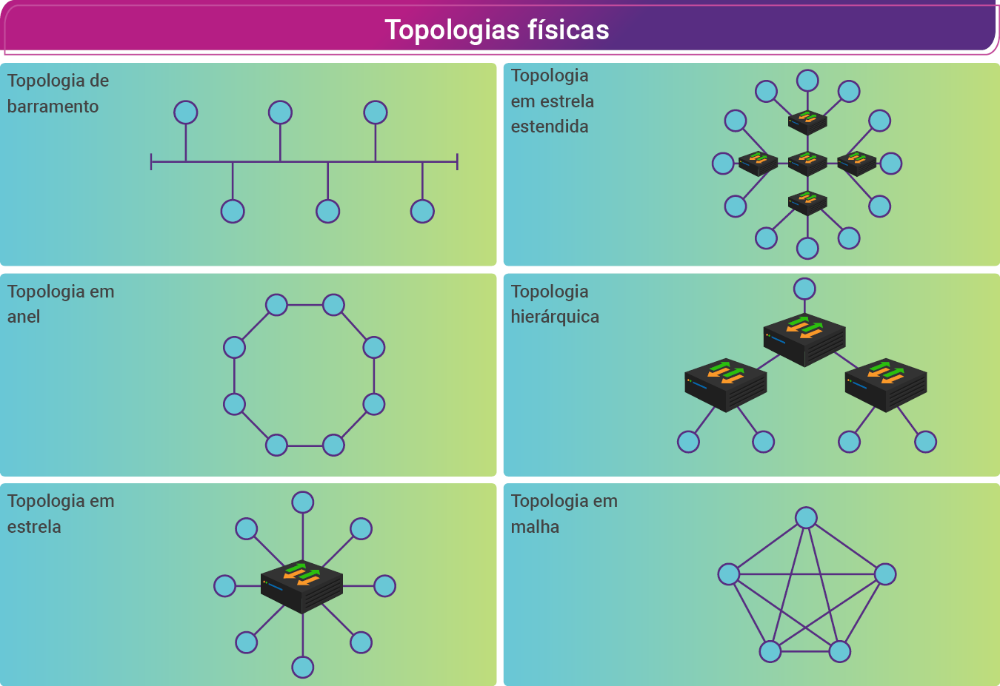

# Topologia Física e Lógica

Equipamentos conectados diretamente a um segmento de rede são chamados de dispositivos.

Temos dois tipos de dispositivos:

- Usuário final: computadores, impressoras, scanners e outros. Também são conhecidos como hosts.
- Rede: Dispositivos que fazem a interconecção de todos os dispositivos dos usuários finais, permitindo que se comuniquem.

Além disso, há duas topologias que definem a estrutura da rede. Uma é a topologia física e outra a topologia lógica.

## Topologia Fìsica

È o layout efetivo dos fios ou meios físicos utilizados. Abaixo algumas topologias físicas:

### Topologia em barramento (bus)

Usa um único cabo backbone que é terminado em ambas as extremidades e todos os hosts são diretamente conectados a ele. Backbone (que significa espinha dorsal ou rede de transporte) é uma rede principal por onde os dados dos clientes trafegam.

### Topologia em anel (ring)

Conecta um host ao próximo e o último host ao primeiro. Isso cria um anel físico utilizando o cabo.

### Topologia em estrela

Conecta todos os cabos a um ponto central de concentração.

### Topologia em estrela estendida (extended star)

Une estrelas individuais ao conectar  hubs ou switches. Essa topologia pode estender a finalidade e a cobertura da rede.

### Topologia hierárquica

É semelhante a uma estrela estendida. Porém, ao invés de unir hubs ou switches, o sistema é vinculado a um computador que controla o tráfego na topologia.

### Topologia em malha (mesh)

É implementada para prover a maior proteção possível contra interrupções de serviço. A utilização de uma topologia em malha nos sistemas de controle, por exemplo, de uma empresa de energia interligada em rede. Assim, cada host tem suas próprias conexões com todos os outros hosts. Apesar de a internet ter vários caminhos (rotas) para qualquer local, ela não adota a topologia em malha completa.

## Topologia Lógica

É a forma como os hosts se comunicam pelos meios. Os dois tipos mais comuns são broadcast e passagem de token.

### Broadcast

Envia os pacotes IP para todos os dispositivos conectados na rede - como a Ethernet atualmente tem.

### Passagem de Token

Envia um token para o host que é uma espécie de permissão para interagir com a rede. Se o host não tem ou não recebe tal token, não pode interagir.